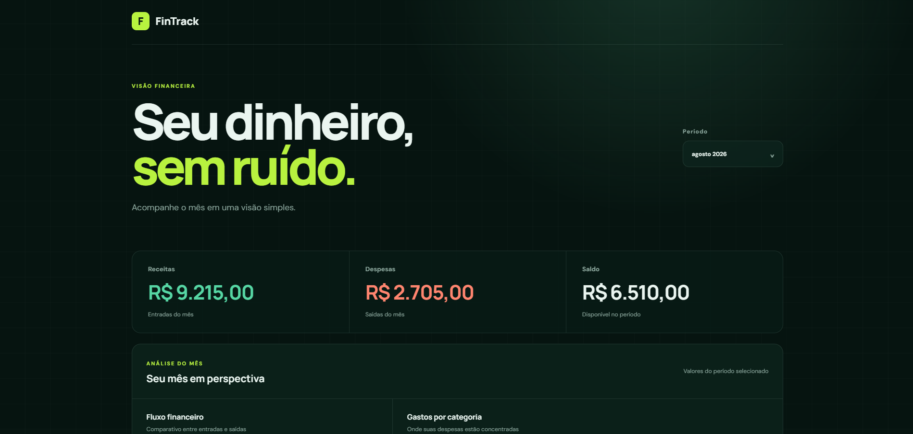
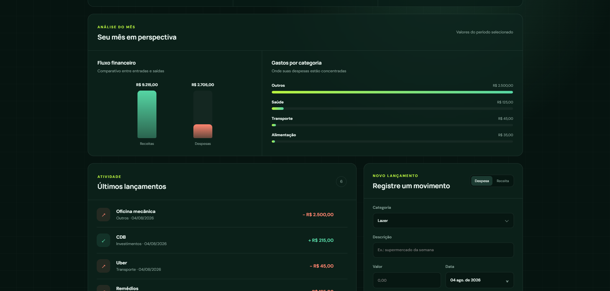
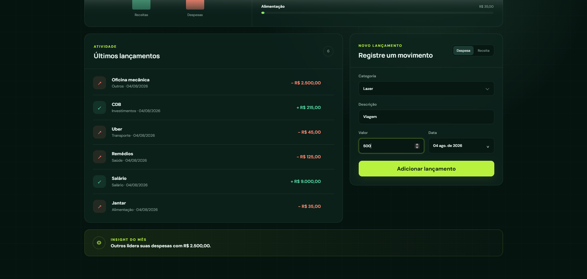
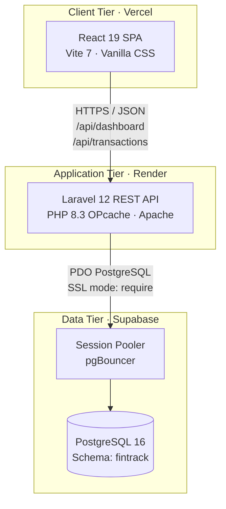
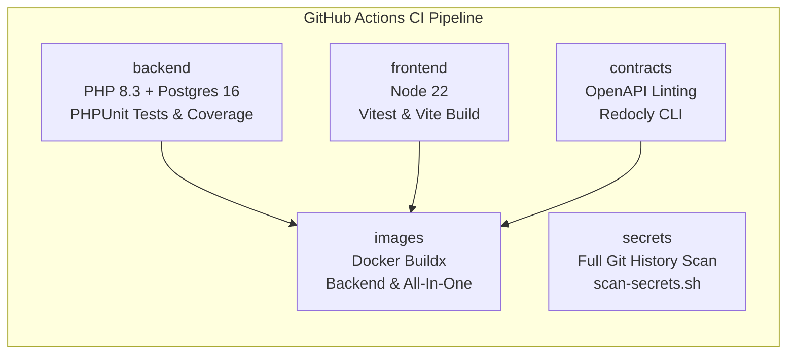

# FinTrack

[](https://github.com/patrickpriebe/fintrack/actions/workflows/ci.yml)


A lean, high-performance personal finance dashboard: a stateless **Laravel 12** REST API, a **React 19** SPA with **zero runtime dependencies beyond React**, and **PostgreSQL 16** running in an isolated private schema on Supabase.

- **Live Application:** [https://fintrack-ui-tan.vercel.app](https://fintrack-ui-tan.vercel.app)
- **API Health Check:** [https://fintrack-api-08b9.onrender.com/api/health](https://fintrack-api-08b9.onrender.com/api/health)
- **API Specification (OpenAPI 3.0):** [`contracts/openapi/fintrack-api.yaml`](contracts/openapi/fintrack-api.yaml)

---

## Table of Contents

- [What it does](#what-it-does)
- [Product tour](#product-tour)
- [Architecture](#architecture)
- [Tech stack & version rationale](#tech-stack--version-rationale)
- [Data model & financial precision](#data-model--financial-precision)
- [API & contracts](#api--contracts)
- [Frontend design system](#frontend-design-system)
- [Security & credential scanning](#security--credential-scanning)
- [CI/CD pipeline](#cicd-pipeline)
- [Cloud deployment & keep-awake](#cloud-deployment--keep-awake)
- [Running locally](#running-locally)
- [Testing strategy](#testing-strategy)
- [Engineering decisions worth reading](#engineering-decisions-worth-reading)
- [Known limits](#known-limits)
- [Documentation](#documentation)

---

## What it does

FinTrack delivers real-time financial clarity without spreadsheet bloat or heavy frontend libraries:

| Flow | What the user experiences |
|---|---|
| **Monthly overview** | Select any month (`YYYY-MM`) and view instant calculations for total income, expenses, and net balance. |
| **Transaction tracking** | Fast entry of categorized income and expenses with validated decimal amounts and custom date assignment. |
| **Category breakdown** | Dynamic distribution chart and leading expense category insights computed directly by the database. |
| **Custom calendar** | Seamless month-picker and date selector with keyboard navigation and zero external UI packages. |
| **Reactive updates** | Instant UI synchronization without full page reloads. |

---

## Product tour

| | |
|---|---|
|  |  |
| **Receitas e Despesas.** Main dashboard view showing monthly KPI cards (Income, Expense, Balance), real-time category insight, recent transaction list, and quick transaction form. | **Análise do Mês.** Comparative visual breakdown of income vs expenses and distribution progress bars by expense category. |
|  |  |
| **Despesas por Categoria.** Leading expense analysis highlighting spending patterns and category proportions. | **Filtros e Calendário.** Period selector with instant live synchronization across metrics and transaction tables. |

---

## Architecture



The application is structured as a decoupled full-stack monorepo:
1. **Frontend (Vercel)**: Static React SPA served via global Edge CDN.
2. **Backend API (Render)**: Containerized PHP 8.3 / Laravel 12 web service.
3. **Database (Supabase)**: Managed PostgreSQL 16 instance accessed through transactional poolers.

---

## Tech Stack & Version Rationale

| Layer | Technology | Version | Rationale |
|---|---|---|---|
| **Runtime / Language** | PHP | `8.3` | Strict typing, typed class constants, performance optimizations with OPcache. |
| **Backend Framework** | Laravel | `12.0` | Lean REST routing, robust `FormRequest` validation, and native Eloquent decimal casting. |
| **Frontend UI** | React | `19.1` | Concurrent rendering, declarative state management, zero runtime UI dependencies. |
| **Frontend Tooling** | Vite | `7.0` | Ultra-fast HMR and optimized tree-shaking for minimal bundle footprint. |
| **Database** | PostgreSQL | `16.0` | ACID transactional reliability, `DECIMAL(12,2)` precision, and composite indexes. |
| **Testing** | PHPUnit / Vitest | `11.5` / `3.2` | Feature/Unit test suites in backend and isolated helper testing in frontend. |
| **API Contracts** | OpenAPI / Redocly | `3.0.3` | Standardized REST contract with CI linting. |
| **Containerization** | Docker | Multi-stage | Hardened Apache production image (`php:8.3-apache`) with automated entrypoint migrations. |
| **CI / CD** | GitHub Actions | Workflows | Parallel testing, full-history secret scanning, contract linting, and Docker validation. |

---

## Data Model & Financial Precision

Transactional data is stored in PostgreSQL inside the isolated **`fintrack`** schema:

```sql
CREATE SCHEMA IF NOT EXISTS fintrack AUTHORIZATION postgres;
REVOKE ALL ON SCHEMA fintrack FROM public;

CREATE TABLE fintrack.transactions (
    id BIGSERIAL PRIMARY KEY,
    type VARCHAR(10) NOT NULL,
    category VARCHAR(50) NOT NULL,
    description VARCHAR(255) NULL,
    amount DECIMAL(12, 2) NOT NULL,
    occurred_on DATE NOT NULL,
    created_at TIMESTAMP(0) WITHOUT TIME ZONE NULL,
    updated_at TIMESTAMP(0) WITHOUT TIME ZONE NULL
);
```

### Key Engineering Guarantees
- **No Floating Point Noise**: Amounts use `DECIMAL(12,2)` in PostgreSQL and `'amount' => 'decimal:2'` in Laravel.
- **Composite Index `(occurred_on, type)`**: Monthly dashboard queries (`SUM(amount)` grouped by category for a specific month) scan index leaf pages directly rather than performing full table scans.
- **Schema Isolation**: Storing tables in `fintrack` instead of `public` prevents automatic exposure by Supabase's PostgREST data API.

Full data modelling details: [docs/02-modelagem-dados.md](docs/02-modelagem-dados.md).

---

## API & Contracts

The API follows strict REST conventions and is formally specified in [`contracts/openapi/fintrack-api.yaml`](contracts/openapi/fintrack-api.yaml):

| Endpoint | Method | Purpose | Response |
|---|---|---|---|
| `/api/health` | `GET` | Container liveness and uptime probe | `200 OK` |
| `/api/dashboard` | `GET` | Monthly totals (income, expense, balance, category breakdown) | `200 OK` / `422` |
| `/api/transactions` | `GET` | List transactions (ordered by date desc, optional `?month=YYYY-MM`) | `200 OK` |
| `/api/transactions` | `POST` | Create a new transaction | `201 Created` / `422` |
| `/api/transactions/{id}` | `GET` | Retrieve single transaction | `200 OK` / `404` |
| `/api/transactions/{id}` | `PUT` | Update existing transaction | `200 OK` / `422` / `404` |
| `/api/transactions/{id}` | `DELETE` | Remove transaction record | `204 No Content` / `404` |

Full API contract guide: [docs/03-api-contratos.md](docs/03-api-contratos.md).

---

## Frontend Design System

The user interface uses **CSS Custom Properties (tokens)** defined in [`frontend/src/styles.css`](frontend/src/styles.css):

- **No CSS framework dependencies** (no Tailwind, Bootstrap, or component libraries).
- **Custom Charts**: Ratio bars and category distributions rendered via native CSS and SVG.
- **Microscopic Bundle**: Total production build bundle footprint is under **60 KB (gzipped)**.

Full frontend architecture: [docs/04-frontend.md](docs/04-frontend.md).

---

## Security & Credential Scanning

FinTrack enforces a **multi-layered credential security barrier**:

1. **Pre-commit Hook ([`.githooks/pre-commit`](.githooks/pre-commit))**:
   - Inspects staged files (`git diff --cached`) for credential formats (Stripe keys, GitHub tokens, AWS keys, database URIs with passwords, private keys) before allowing a commit.
2. **History-Wide Secret Scanning ([`.github/scripts/scan-secrets.sh`](.github/scripts/scan-secrets.sh))**:
   - Runs in GitHub Actions CI with `fetch-depth: 0`, scanning **all commits across repository history** (`git rev-list --all`) to ensure no forgotten keys remain accessible in past revisions.

---

## CI/CD Pipeline

The GitHub Actions pipeline ([`.github/workflows/ci.yml`](.github/workflows/ci.yml)) executes on every push and pull request with `cancel-in-progress: true`:



---

## Cloud Deployment & Keep-Awake

| Service | Provider | Configuration |
|---|---|---|
| **Frontend** | **Vercel** | Edge Network, automatic deployment from `main`. |
| **Backend API** | **Render** | Docker runtime, defined via [`render.yaml`](render.yaml). |
| **PostgreSQL** | **Supabase** | Managed PostgreSQL 16 (AWS us-west-2 pooler, SSL require). |

### Scheduled Keep-Awake Workflow
Render free-tier instances hibernate after 15 minutes of inactivity. To prevent cold-start delays during working hours without exhausting monthly quotas, [`.github/workflows/keep-awake.yml`](.github/workflows/keep-awake.yml) executes a lightweight health check ping every 10 minutes between 9:00 and 16:00 BRT on weekdays (~154h/month, safely within the 750h limit).

---

## Running Locally

### Option 1: Docker Compose (Recommended)

```bash
# Start PostgreSQL and production-like app container
docker compose up -d

# Or start with live hot-reloading frontend development server
docker compose --profile dev up -d
```

- App URL: [http://localhost:8000](http://localhost:8000)
- Vite Dev Server: [http://localhost:5173](http://localhost:5173)
- PostgreSQL: `localhost:5432` (`fintrack` / password from `.env`)

### Option 2: Running from Source

**Backend:**
```bash
cd backend
composer install
cp .env.example .env
php artisan key:generate
php artisan migrate
php artisan serve
```

**Frontend:**
```bash
cd frontend
npm install
npm run dev
```

---

## Testing Strategy

| Suite | Technology | Focus |
|---|---|---|
| **Backend Feature Tests** | PHPUnit 11 | API endpoints (`/health`, `/dashboard`, `/transactions`), validation errors, database integrity. |
| **Backend Unit Tests** | PHPUnit 11 | Eloquent model casting, fillable rules, decimal formatting. |
| **Frontend Unit Tests** | Vitest 3 | Currency formatting (`formatCurrency`) and date parsing utilities. |

Run tests locally:
```bash
# Backend test suite
cd backend && php artisan test

# Frontend test suite
cd frontend && npm test
```

---

## Engineering Decisions Worth Reading

- **Database Aggregations vs Memory Loops**: Sums and groupings are calculated directly in SQL (`SUM(amount)` with `GROUP BY category`). Querying aggregated totals from indexed columns keeps memory usage constant regardless of transaction volume.
- **Zero Runtime UI Dependencies**: Eliminating component libraries (Tailwind, MUI, Chart.js) produces sub-60 KB production bundles and guarantees complete control over accessibility and CSS layout.
- **Schema Isolation in Managed PostgreSQL**: Creating a dedicated `fintrack` schema prevents Supabase from exposing transactional data via public Data APIs.
- **Development Reverse Proxy**: Vite's dev server proxies `/api` requests to the Laravel backend container, matching production behavior and avoiding CORS preflight requests locally.

---

## Known Limits

- **Single-User Scope**: Current version operates as a single-tenant instance (multi-user authentication is scheduled for Phase 3).
- **No Export Options**: CSV and PDF export endpoints are planned in Phase 5.
- **No Direct Bank Sync**: Intentionally excluded to avoid third-party banking aggregator dependencies and maintain an educational, transparent architecture.

Roadmap details: [docs/05-roadmap-produto.md](docs/05-roadmap-produto.md).

---

## Documentation

- [Architecture & Design Decisions](docs/01-arquitetura.md) — System boundaries, Docker multi-stage build, and security.
- [Data Modelling & Indexing](docs/02-modelagem-dados.md) — Relational schema, composite indexes, and decimal precision.
- [API Contracts & Endpoints](docs/03-api-contratos.md) — REST API specifications and validation rules.
- [Frontend Architecture](docs/04-frontend.md) — CSS design tokens, custom SVG charts, and state management.
- [Product Roadmap](docs/05-roadmap-produto.md) — Completed milestones and upcoming feature phases.
- [API Specification (OpenAPI 3.0)](contracts/openapi/fintrack-api.yaml) — Formal machine-readable contract.
