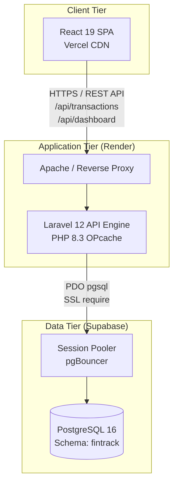

# Architecture

## Overview

**FinTrack** is designed as a decoupled, high-performance financial management application. The architecture prioritizes low latency, strict data integrity, separation of concerns, and clean infrastructure definitions.

---

## Key Architectural Decisions

### 1. Decoupled Monorepo Structure
The repository manages both the frontend and backend in a unified repository while maintaining completely independent build, test, and deployment lifecycles:
- **`frontend/`**: Compiled statically via Vite 7 and deployed globally to Vercel's Edge Network.
- **`backend/`**: Packaged into an optimized container image (`php:8.3-apache`) and deployed as a web service on Render.
- **`supabase/`**: Declarative SQL migrations ensuring schema isolation.

### 2. Multi-Stage Docker Architecture
The container strategy uses multi-stage builds to produce minimal, hardened production images:
1. **Frontend Stage (`node:22-alpine`)**: Builds production assets with tree-shaking and minification.
2. **Vendor Stage (`composer:2.8`)**: Resolves PHP dependencies with `--no-dev` and `--optimize-autoloader`.
3. **Production Stage (`php:8.3-apache`)**: Hardened Apache runtime with OPcache enabled, non-root configurations, Apache module optimizations (`rewrite`, `headers`, `expires`), and an automated migration entrypoint.

### 3. Database Schema Isolation
FinTrack connects to PostgreSQL through a dedicated `fintrack` schema instead of using the shared default `public` schema.
- Anon and public data API roles from Supabase are stripped of permissions on the `fintrack` schema (`REVOKE ALL ON SCHEMA fintrack FROM public;`).
- All database interactions flow exclusively through the authenticated Laravel application layer, protecting against unintended data exposure.

### 4. Reverse Proxying & CORS Strategy
- In local development, Vite provides a built-in proxy forwarding `/api` to the backend container, eliminating cross-origin preflight overhead.
- In production, Vercel routes `/api/(.*)` directly to the Render endpoint or the SPA calls the dedicated backend with explicit CORS whitelisting (`FRONTEND_URLS`).

---

## Component Boundaries

| Component | Responsibility | Tech Stack | Runtime Environment |
|---|---|---|---|
| **Frontend** | UI, state management, client-side formatting, SVG/CSS charts | React 19, Vite 7, CSS Variables | Vercel CDN |
| **Backend API** | Business rules, request validation, financial aggregations, health probes | Laravel 12, PHP 8.3 | Render (Docker) |
| **Database** | ACID transactional persistence, relational integrity, composite indexes | PostgreSQL 16 | Supabase (AWS Pooler) |
