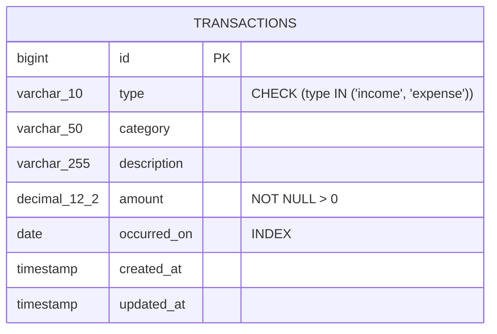

# Data Modelling & Database Design

## Database Schema (`fintrack.transactions`)

The primary data entity in FinTrack is the `transactions` table, designed for high read and aggregation efficiency.



---

## Schema Definition (PostgreSQL 16)

```sql
CREATE SCHEMA IF NOT EXISTS fintrack AUTHORIZATION postgres;
REVOKE ALL ON SCHEMA fintrack FROM public;

CREATE TABLE fintrack.transactions (
    id BIGSERIAL PRIMARY KEY,
    type VARCHAR(10) NOT NULL,
    category VARCHAR(50) NOT NULL,
    description VARCHAR(255) NULL,
    amount DECIMAL(12, 2) NOT NULL,
    occurred_on DATE NOT NULL,
    created_at TIMESTAMP(0) WITHOUT TIME ZONE NULL,
    updated_at TIMESTAMP(0) WITHOUT TIME ZONE NULL
);

-- Indexing Strategy
CREATE INDEX idx_transactions_type ON fintrack.transactions(type);
CREATE INDEX idx_transactions_category ON fintrack.transactions(category);
CREATE INDEX idx_transactions_occurred_on ON fintrack.transactions(occurred_on);
CREATE INDEX idx_transactions_occurred_type ON fintrack.transactions(occurred_on, type);
```

---

## Engineering Decisions & Precision

### 1. Decimal Precision over Floating Point
- Monetary values are stored as `DECIMAL(12,2)` in PostgreSQL and mapped with Laravel's Eloquent cast `'amount' => 'decimal:2'`.
- Floating-point representations (such as `FLOAT` or `DOUBLE`) introduce binary rounding noise (e.g., `0.1 + 0.2 != 0.3`). In financial balances, exact decimal arithmetic is non-negotiable.

### 2. Composite Index on `[occurred_on, type]`
- The dashboard metrics endpoint (`GET /api/dashboard?month=YYYY-MM`) frequently executes queries of the form:
  ```sql
  SELECT category, SUM(amount) AS total
  FROM fintrack.transactions
  WHERE EXTRACT(YEAR FROM occurred_on) = 2026
    AND EXTRACT(MONTH FROM occurred_on) = 8
    AND type = 'expense'
  GROUP BY category
  ORDER BY total DESC;
  ```
- The composite index `(occurred_on, type)` allows PostgreSQL to perform an Index Scan directly covering the date range and transaction type without scanning unrelated months or income rows.

### 3. Date Isolation (`DATE` vs `TIMESTAMP`)
- `occurred_on` is stored as an ISO `DATE` (`YYYY-MM-DD`).
- Financial entries in personal accounting belong to a calendar day, independent of user timezone shifts. Storing timestamps with local offsets can lead to month-boundary shifting bugs when queried internationally.

### 4. Schema Isolation on Managed Cloud Databases
- In Supabase, the default schema is `public`, which is directly exposed to PostgREST/GraphQL data APIs unless locked down.
- FinTrack provisions the isolated `fintrack` schema with permissions restricted solely to the application connection pooler.
